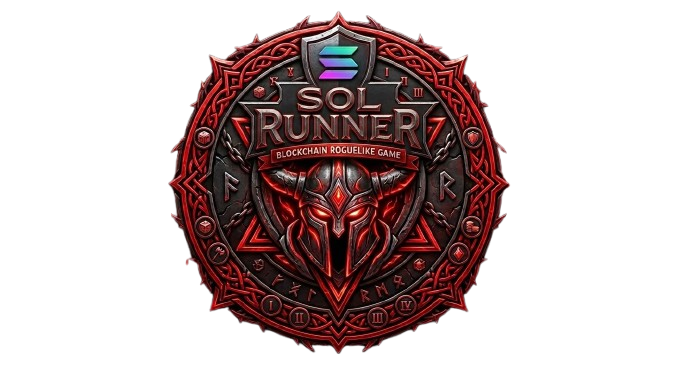

<p align="center">
  
</p>

<h1 align="center">SOL RUNNER</h1>

<p align="center">
  Arena roguelite web con autenticación mediante Phantom Wallet, progresión por niveles y recompensas conectadas a Solana.
</p>

---

# SOL RUNNER

SOL RUNNER es un juego web tipo **arena roguelite** conectado con **Solana**, donde el jugador inicia sesión con su wallet **Phantom**, firma un mensaje para autenticarse, entra a runs de combate por pisos, obtiene recompensas, compra mejoras y administra una colección de skins/personajes dentro del juego.

El proyecto combina dos partes claramente definidas:

- una **experiencia de juego web** construida con HTML, CSS y JavaScript
- una **integración blockchain con Solana** para autenticación y sistema de recompensas

La idea central del proyecto es que la wallet no sea solo un login decorativo, sino una identidad real del jugador dentro del sistema.

---

# Tabla de contenido

- [Visión general](#visión-general)
- [Objetivo del proyecto](#objetivo-del-proyecto)
- [Arquitectura general](#arquitectura-general)
- [Tecnologías utilizadas](#tecnologías-utilizadas)
- [Estructura del proyecto](#estructura-del-proyecto)
- [Flujo funcional del sistema](#flujo-funcional-del-sistema)
- [Sistema de autenticación con Phantom](#sistema-de-autenticación-con-phantom)
- [Sistema de juego](#sistema-de-juego)
- [Sistema de tienda](#sistema-de-tienda)
- [Sistema de colección y skins](#sistema-de-colección-y-skins)
- [Parte NFT y alcance real](#parte-nft-y-alcance-real)
- [Sistema de oráculo y recompensas diarias](#sistema-de-oráculo-y-recompensas-diarias)
- [Sistema de rewards on-chain](#sistema-de-rewards-on-chain)
- [Wallet del backend vs wallet del jugador](#wallet-del-backend-vs-wallet-del-jugador)
- [Persistencia de datos](#persistencia-de-datos)
- [Cómo instalar y ejecutar el proyecto](#cómo-instalar-y-ejecutar-el-proyecto)
- [Cómo probar el proyecto paso a paso](#cómo-probar-el-proyecto-paso-a-paso)
- [Variables de entorno](#variables-de-entorno)
- [Endpoints del backend](#endpoints-del-backend)
- [Assets y archivos visuales](#assets-y-archivos-visuales)
- [Problemas comunes](#problemas-comunes)
- [Estado actual del proyecto](#estado-actual-del-proyecto)
- [Mejoras futuras](#mejoras-futuras)

---

# Visión general

SOL RUNNER está diseñado como un juego web con identidad propia, evitando el enfoque típico de dashboards técnicos.

La experiencia se divide en tres estados principales claramente separados:

1. **Pantalla de login / conexión**  
   El usuario conecta su wallet Phantom y firma autenticación.

2. **Menú principal**  
   Se concentran todas las acciones del juego: iniciar run, abrir tienda, oráculo, reclamar recompensas y revisar estado del personaje.

3. **Gameplay**  
   Pantalla dedicada exclusivamente al juego, con canvas, HUD, enemigos, boss y progresión por piso.

La tienda y el oráculo se manejan como **modales**, lo que evita romper la experiencia del usuario y mantiene continuidad visual.

---

# Objetivo del proyecto

El objetivo de SOL RUNNER es demostrar una integración funcional entre:

- experiencia de juego web
- autenticación basada en wallet
- recompensas conectadas a Solana
- sistema de colección de skins
- progresión del jugador

No se busca únicamente conectar una wallet, sino construir un flujo donde:

- la wallet represente al jugador
- las recompensas tengan valor dentro del sistema
- la colección pueda escalar a NFTs reales
- el juego tenga base para evolucionar

---

# Arquitectura general

El proyecto está dividido en dos capas principales:

## 1. Frontend

Se encarga completamente de la experiencia del usuario y del juego.

Responsabilidades:
- render de pantallas
- HUD
- canvas y lógica de render
- control del jugador
- tienda y oráculo
- inventario local
- lógica de runs
- comunicación con backend
- manejo de sesión

---

## 2. Backend

Se encarga de la lógica crítica del sistema y la conexión con blockchain.

Responsabilidades:
- generación de nonce
- verificación de firma con Phantom
- creación de sesión
- registro de runs
- cálculo de recompensas
- envío de recompensas reales
- conexión con RPC de Solana

---

# Tecnologías utilizadas

## Frontend

### HTML5
Se utiliza para estructurar:
- login
- menú principal
- gameplay
- HUD
- modales
- canvas

### CSS3
Se utiliza para:
- diseño visual completo
- layout del juego
- estilos del HUD
- tienda y colección
- animaciones
- responsive

### JavaScript (Vanilla)
Se utiliza para:
- lógica del juego
- render en canvas
- movimiento y disparo
- enemigos y boss
- sistema de tienda
- inventario
- progresión
- conexión con backend

---

## Backend

### Node.js
Entorno de ejecución del servidor.

### Express
Se utiliza para:
- creación de endpoints
- manejo de requests
- autenticación
- lógica de rewards

---

## Blockchain

### @solana/web3.js
Se utiliza para:
- conexión con Solana
- manejo de wallets
- transferencias
- consulta de balances

### Phantom Wallet
Se utiliza para:
- autenticación del usuario
- firma de mensajes
- recepción de recompensas

---

## Persistencia local

### localStorage
Se utiliza para almacenar:

- skins compradas
- skin equipada
- mejoras
- progreso del jugador
- estado del oráculo
- reward local

---

# Estructura del proyecto

## Frontend

```text
frontend/
│
├── index.html
├── style.css
├── wallet.js
├── game.js
├── api.js
│
└── assets/
    ├── images/
    │   └── sol-runner-logo.png
    └── icons/
        └── solrun.ico