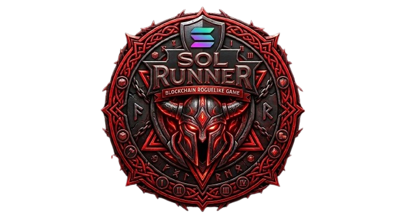

<p align="center">
  
</p>

<h1 align="center">SOL RUNNER</h1>

<p align="center">
  Arena roguelite Web3 construido sobre Solana con autenticación mediante Phantom Wallet, sistema de recompensas y progresión conectada a blockchain.
</p>

---

<p align="center">
  <a href="https://sol-runner.onrender.com">Demo Web</a>
  ·
  <a href="https://youtu.be/9k9FAtFfYjg">Video Demo</a>
  ·
  <a href="https://github.com/Polar2565/SOL-RUNNER">Repositorio GitHub</a>
</p>

---

# SOL RUNNER

SOL RUNNER es un videojuego web tipo arena roguelite integrado con la blockchain de Solana. Los jugadores conectan su Phantom Wallet, se autentican mediante firma digital y entran a partidas donde deben sobrevivir oleadas de enemigos, avanzar pisos, obtener recompensas y progresar dentro de un sistema conectado con Web3.

El proyecto combina:

- gameplay tipo roguelite
- autenticación con wallet
- validación de recompensas
- integración con Solana
- progresión del jugador
- economía conectada a blockchain
- sistema de colección y skins

A diferencia de los juegos tradicionales donde las recompensas y cuentas existen únicamente dentro de servidores privados, SOL RUNNER utiliza Solana para construir un flujo verificable conectado directamente a la wallet del jugador.

---

# Características principales

## Autenticación con Phantom Wallet

- conexión de wallet Phantom
- autenticación mediante firma
- la wallet funciona como identidad del jugador
- sistema de login seguro sin contraseñas

## Gameplay tipo Arena Roguelite

- supervivencia por oleadas
- enemigos progresivos
- dificultad creciente
- progresión por pisos
- combate en tiempo real
- sistema de boss

## Sistema de recompensas

- validación de rewards desde backend
- transacciones en Solana Devnet
- distribución de recompensas
- progresión conectada con blockchain

## Sistema de tienda y mejoras

- mejoras dentro del juego
- progresión del personaje
- desbloqueo de contenido
- persistencia local

## Sistema de skins y personajes

- cosméticos
- personalización
- estructura preparada para NFTs
- inventario persistente

## Integración Web3

- conexión con Solana
- identidad mediante wallet
- arquitectura preparada para on-chain
- sistema de recompensas verificable

---

# Problema

Muchos videojuegos tradicionales utilizan sistemas completamente centralizados donde:

- las recompensas no son verificables
- los jugadores no poseen realmente sus activos
- toda la progresión depende de bases de datos privadas
- no existe transparencia en economías internas

Por otro lado, muchos juegos blockchain priorizan únicamente la especulación y descuidan la experiencia de juego.

---

# Solución

SOL RUNNER busca combinar gameplay primero y blockchain después.

La idea no es usar wallets únicamente como login decorativo, sino convertirlas en parte de la identidad y progresión del jugador. Solana permite validar recompensas, realizar transacciones rápidas y construir una infraestructura escalable para futuras integraciones como NFTs, tokens o marketplace.

El proyecto busca hacer el Web3 gaming más accesible mediante:

- experiencia simple
- partidas rápidas
- conexión intuitiva con wallet
- acceso desde navegador
- baja fricción para nuevos usuarios

---

# Arquitectura

El proyecto está dividido en tres capas principales.

---

## Frontend

Responsable de toda la experiencia visual y gameplay.

### Responsabilidades

- render del juego
- HUD
- canvas
- controles
- menús y modales
- sistema de tienda
- progresión visual
- comunicación con backend
- conexión con wallet

### Tecnologías

- HTML5
- CSS3
- JavaScript Vanilla
- Canvas API

---

## Backend

Responsable de autenticación, validación y lógica blockchain.

### Responsabilidades

- generación de nonce
- validación de firmas
- manejo de sesiones
- validación de rewards
- lógica de recompensas
- conexión con Solana
- validación de runs

### Tecnologías

- Node.js
- Express.js

---

## Blockchain

Capa encargada de la interacción con Solana.

### Responsabilidades

- autenticación mediante wallet
- validación de transacciones
- envío de recompensas
- interacción con RPC
- conexión con Devnet

### Tecnologías

- Solana Devnet
- Phantom Wallet
- @solana/web3.js

---

# Tecnologías utilizadas

## Frontend

- HTML5
- CSS3
- JavaScript
- Canvas API

## Backend

- Node.js
- Express

## Blockchain

- Solana Devnet
- Phantom Wallet
- @solana/web3.js

## Deploy

- Render

---

# Flujo de autenticación

El sistema utiliza autenticación mediante Phantom Wallet en lugar de usuario y contraseña tradicionales.

### Flujo

1. El usuario conecta Phantom
2. El backend genera un nonce
3. El usuario firma el mensaje
4. El backend valida la firma
5. Se crea la sesión
6. La wallet funciona como identidad del jugador

Esto permite autenticación segura sin almacenar contraseñas.

---

# Sistema de recompensas

El sistema conecta gameplay y validación blockchain.

### Flujo actual

- el jugador termina una partida
- el backend valida el resultado
- se calcula la recompensa
- la wallet treasury envía el reward
- la transacción se valida en Solana Devnet

La arquitectura está preparada para futuras integraciones como:

- SPL Tokens
- NFTs
- marketplace
- rewards estacionales
- ranking rewards

---

# ¿Por qué Solana?

Solana es necesaria porque el proyecto requiere:

- transacciones rápidas
- bajas comisiones
- autenticación basada en wallet
- rewards verificables
- infraestructura escalable para gaming

Una base de datos tradicional podría guardar puntos de manera interna, pero no ofrecería:

- transparencia
- validación pública
- propiedad digital
- interoperabilidad blockchain
- rewards verificables

Solana permite construir una experiencia Web3 real manteniendo velocidad y escalabilidad.

---

# Gameplay principal

El flujo principal del juego es:

1. conectar wallet
2. autenticarse con Phantom
3. iniciar run
4. derrotar enemigos
5. avanzar pisos
6. obtener recompensas
7. mejorar personaje
8. repetir progresión

El diseño está enfocado en sesiones rápidas y rejugables.

---

# Sistema de tienda

El jugador puede interactuar con una tienda integrada dentro del menú principal.

### Características

- mejoras
- progresión persistente
- sistema cosmético
- estructura preparada para NFTs
- escalado de progresión

---

# Sistema de skins y cosméticos

SOL RUNNER incluye una estructura preparada para expansión futura.

### Características actuales

- skins
- inventario cosmético
- personaje equipado persistente
- almacenamiento local

### Expansión futura

- skins NFT
- rarezas
- marketplace
- temporadas

---

# Estructura del proyecto

```text
SOL-RUNNER/
│
├── frontend/
│   ├── index.html
│   ├── style.css
│   ├── game.js
│   ├── wallet.js
│   ├── api.js
│   ├── ui.js
│   ├── assets/
│   │   ├── images/
│   │   ├── icons/
│   │   ├── enemies/
│   │   └── characters/
│   │
│   └── audio/
│
├── backend/
│   ├── server.js
│   ├── routes/
│   ├── controllers/
│   ├── services/
│   ├── utils/
│   ├── wallet/
│   └── middleware/
│
├── package.json
├── README.md
└── .env
```

---

# Demo web

https://sol-runner.onrender.com

---

# Video demo

https://youtu.be/9k9FAtFfYjg

---

# Repositorio

https://github.com/Polar2565/SOL-RUNNER

---

# Instalación

## Clonar repositorio

```bash
git clone https://github.com/Polar2565/SOL-RUNNER.git
```

---

## Instalar dependencias

### Backend

```bash
cd backend
npm install
```

---

## Ejecutar backend

```bash
npm run dev
```

---

## Ejecutar frontend

Abrir:

```text
frontend/index.html
```

o ejecutar usando Live Server.

---

# Variables de entorno

Crear un archivo `.env` dentro de backend:

```env
RPC_URL=your_solana_rpc
TREASURY_PRIVATE_KEY=your_private_key
PORT=3000
```

---

# Endpoints backend

## Autenticación

- POST `/auth/nonce`
- POST `/auth/verify`

## Rewards

- POST `/reward/claim`
- GET `/reward/status`

## Gameplay

- POST `/run/start`
- POST `/run/finish`

---

# Persistencia

Actualmente el proyecto utiliza:

## localStorage

Para:

- skins
- mejoras
- personaje equipado
- progreso local
- preferencias del jugador

## Backend

Para:

- validación de autenticación
- validación de rewards
- validación de gameplay

---

# Estado actual del proyecto

Estado actual:

- MVP funcional
- integración con Phantom Wallet
- integración con Solana Devnet
- gameplay funcional
- sistema de rewards
- backend operativo
- deploy activo
- mejoras de progresión en desarrollo
- balanceo en progreso
- estructura preparada para NFTs

---

# Roadmap

## Corto plazo

- mejoras de gameplay
- balanceo
- leaderboard
- mejoras UI/UX
- responsive móvil

## Mediano plazo

- integración SPL Tokens
- skins NFT
- ranking global
- matchmaking
- contenido estacional

## Largo plazo

- multiplayer
- marketplace
- torneos
- sistemas comunitarios
- despliegue Mainnet

---

# Equipo

## Javier Solís

Founder / CTO / Lead Developer

Responsable de:

- arquitectura
- frontend
- backend
- integración Solana
- gameplay
- deploy

GitHub:

https://github.com/Polar2565

LinkedIn:

https://linkedin.com/in/javier-solis-23689b315/

---

## Carlos Azael

Backend Developer / Blockchain Support

GitHub:

https://github.com/CarlosAzaCastM

---

## Luis Palacio

Product & Operations / QA Support

GitHub:

https://github.com/CashPH

---

# Visión

SOL RUNNER busca convertirse en una experiencia Web3 gaming donde blockchain complemente el gameplay en lugar de reemplazarlo.

El objetivo es crear una puerta de entrada accesible al gaming Web3 manteniendo una filosofía enfocada primero en la experiencia del jugador.

---

# Licencia

Proyecto actualmente en desarrollo para incubación y crecimiento como startup Web3.
